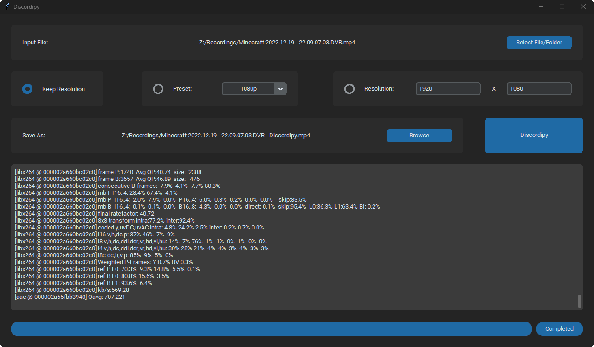

# Discordi.py
A simple Python application to compress video files to send without Discord Nitro.

## Usage

Requires user to have ffmpeg binaries installed and PATH variables set.

Here is a written guide to install ffmpeg. (https://phoenixnap.com/kb/ffmpeg-windows)

Here is a video guide to install ffmpeg. (https://youtu.be/IECI72XEox0?t=277)